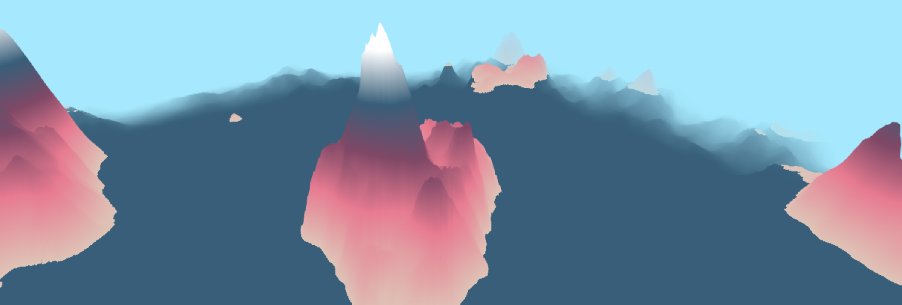
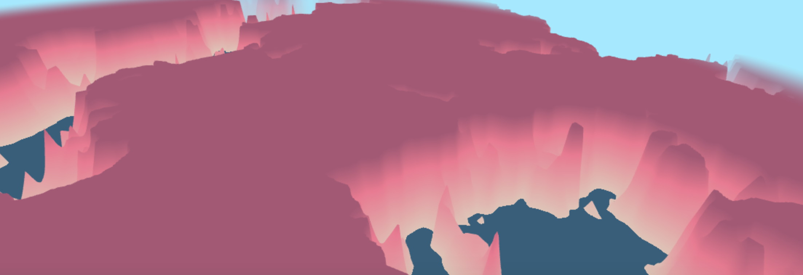

# noisy-terrain
by Annie Su, anniesu1

## Implementation
- Fractal brownian motion (fbm): utilized fbm to take an input of (x, z) coordinates and return a float used to map terrain elevation. The fbm method samples an 2d noise interpolation function at an exponentially increasing frequency (by a power of 2.0) and exponentially decreasing (by a power of the function argument `persistence`) amplitude. This is done over several iterations, the number of which is specified by the `octaves` function argument, and each sample is summed. The final sum is the output, which is then used to dictate the height of the terrain given an (x, z) coordinate. The result looks like cloudy mountains. The user may adjust the number of octaves that are added during the fbm computation via the GUI. 

- Perlin noise: utilized perlin noise in the same way as fbm--to generate a height map. For the dusky mountains biome, to obtain more level plains and craggier mountains, I raised the noise output to an exponent greater than 1. The GUI allows the user to adjust the number of octaves that are added during the perlin noise computation. 

- Height redistribution: for the mesas biome, I redistributed the height using a pow function (like with the dusky mountains biome) to obtain more level plains and taller heights. I then clamped the height to create sharp plateaus. 

## External Resources
- Referenced perlin noise function from [here](https://gist.github.com/patriciogonzalezvivo/670c22f3966e662d2f83)
- Read about procedurally generated plateaus from [here](https://www.seedofandromeda.com/blogs/58-procedural-heightmap-terrain-generation)

## Link to github.io Demo
https://anniesu1.github.io/noisy-terrain/
